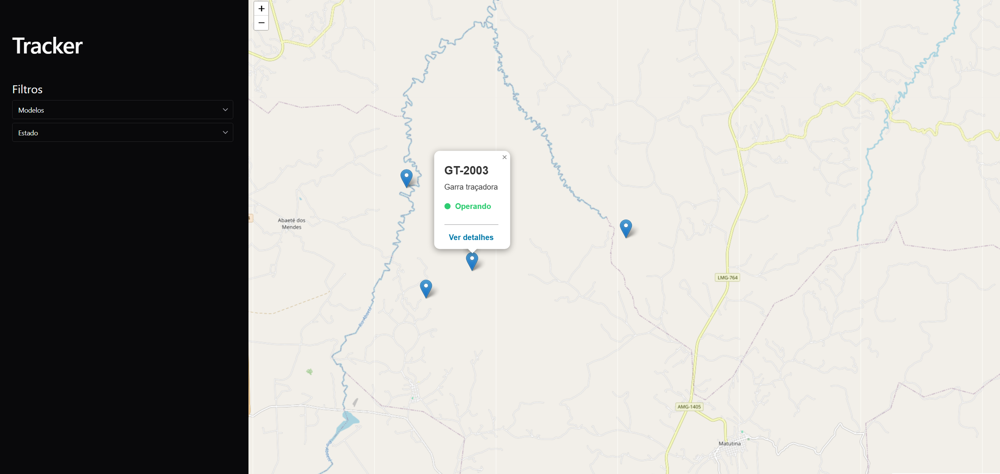
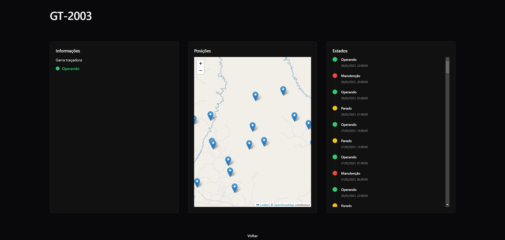
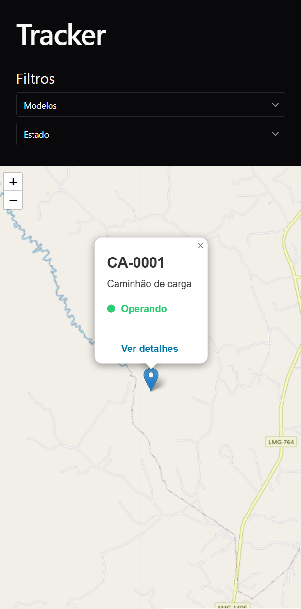
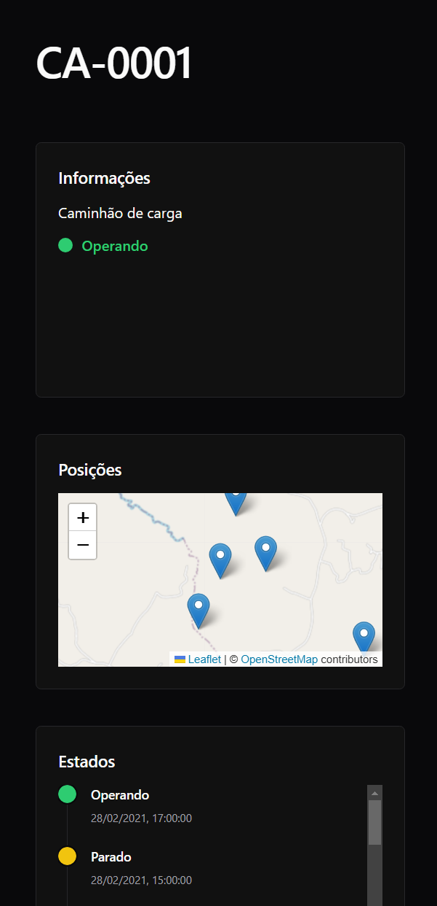
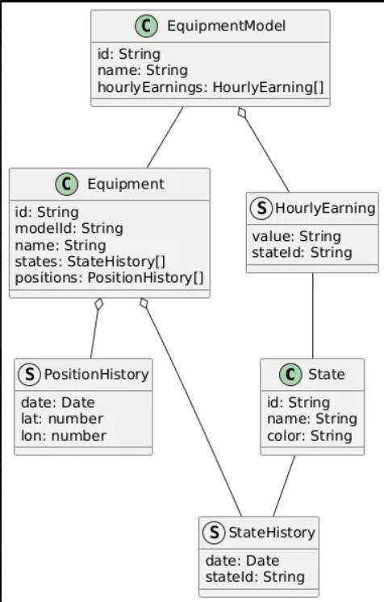
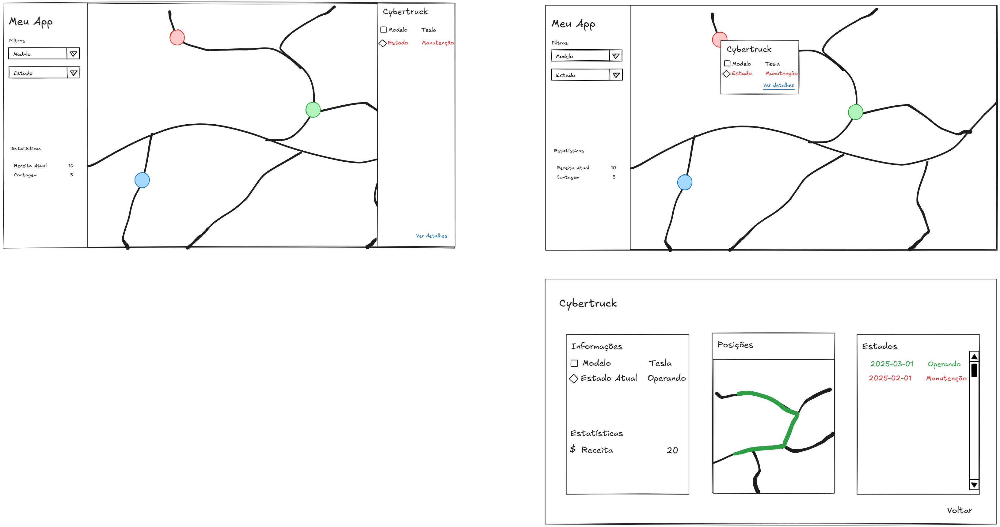

# Tracker

O aplicativo Tracker é pode encontrar os dispositivos e informações deles. Este app foi desenvolvido como parte de um desafio para a empresa Aiko.

## Funcionalidades

- Listar dispositivos no mapa
- Mostrar detalhes no mapa sobre um equipamento
- Filtragem de equipamentos no mapa

## Processo de desenvolvimento

Inicialmente foi feita a leitura e entendimento do case através da leitura do repositório com o teste.

Em seguida, tentei entender os relacionamentos entre os dados, resultando no seguinte modelo.

Com isso em mente, pude começar a pensar nos casos de uso e a esboçar um rascunho do frontend também. Este rascunho foi feito no excalidraw.

Depois parti para o desenvolvimento backend, onde fiz a implementação da lógica de forma isolada.

Quando back estava pronto, passei para o desenvolvimento do front. E por fim integrei ambos.

## Escolha de Tecnologias

- Leaflet: O Leaflet foi escolhido por ser uma tecnologia de mapas que é simples de usar e não requer chaves de API. Por essa característica o uso de SSR pode evitado, facilitando o desenvolvimento e mantendo a aplicação client side.
- Chakra UI: Biblioteca de componentes que possui muitos os elementos visuais já pré-programados que facilitam a definição do layout e estilização com CSS via classes. Este também foi escolhido por preferencia pessoal em acha-lo mais agradável que outras como Bootstrap ou Material UI.
- FontAwesome: Escolhido por ter um conjunto amplo de ícones modernos e com várias variações. Além do fato que grande parte dele é gratúido.
- React Router: Transicionar entre as páginas de forma mais sútil e desacoplada. Esta ferramenta consegue ajudar ao desenvolvimento limpo e mais modular.

## Como executar

É preciso ter o Node.js instalado na versão 20 ou superior. A partir disso, execute os comandos:

1. `npm install`
2. `npm start`
3. Acesse o navegador e entre na URL `http://localhost:3000`

## Melhorias identificadas

- Adicionar testes unitáirios e funcionais através do Jest
- Adicionar testes snapshot e documentação de componentes com Storybook
- Fazer os extras sugeridos, e.g. calculo com hourly earnings
